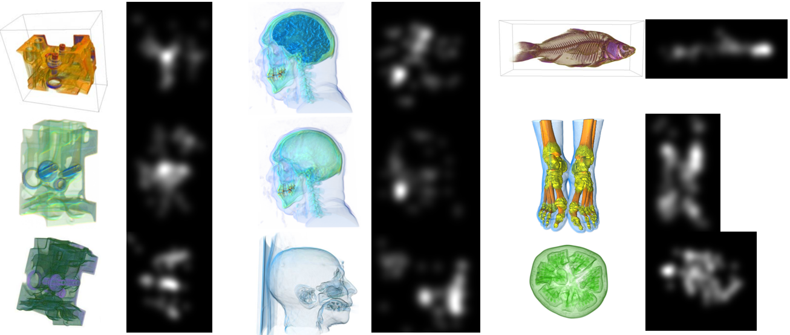

## Capstone Project - Ensemble Modelling for Saliency Prediction of Viewer's Attention for Volumetric Images

 

## SECTION 1 : EXECUTIVE SUMMARY / PAPER ABSTRACT

Saliency in image processing refers to the unique qualities such as resolution and pixel qualities within an image that manifests itself as features that draws the attention of a viewer. Processing these images to a topographical representation produces saliency maps to differentiate the visual features of the image to understand how human perception makes sense of these images. Saliency mapping techniques can be broadly categorised into using two contrasting techniques namely handcrafted (manually engineered) versus learned features (automatically obtained by machine learning algorithm). 

This project is an investigation into the latter technique using a deep learning approach to analyse and understand how our saliency mapping model performs against existing saliency mapping model benchmarks as applied to the context of 2D images of volumetric data. Based on a survey of existing techniques using deep learning for saliency mapping, we have been inspired to design and apply a novel convolution neural architecture (CNN) we have called EN3Net that is an ensemble model concatenated from the pretrained CNN models of VGG16, VGG19 and ResNet50, chosen based on their performance in the ImageNet competition in recent years. 

## SECTION 2 : TEAM MEMBERS

| Official Full Name  | Student ID (MTech Applicable)  | Email (Optional) |
| :------------ |:---------------:| :-----|
| PREM CHANDRAN | A0195324A  | E0384955@u.nus.edu |
| YONG QUAN ZHI, TOMMY | A0195353Y | E0384984@u.nus.edu |

## SECTION 3 : Project Implementation Info

1. CNNs(Resnet50, Vgg16, Vgg19) were preloaded with pretrained weights from imagenet.
2. Training/Validation dataset used is SALICON dataset.
3. 70 Volumetric Test Images taken from this paper [[1]](#1).

-----------------------------------------------------------------------------------------------------

## SECTION 4 : References

<a id="1">[1]</a> 
Cai, Lile. (2015). 
IMPORTANCE-DRIVEN TRANSFER FUNCTION
DESIGN FOR VOLUME VISUALIZATION OF MEDICAL
IMAGES.

The code used in this project was taken from various research saliency project found below.

**Code for evaluation metrics**
https://github.com/tarunsharma1/saliency_metrics

**JuntingNet**
https://github.com/imatge-upc/saliency-2016-cvpr

**SAM-ResNet**
https://github.com/marcellacornia/sam

**MLNet**
https://github.com/marcellacornia/mlnet

**SalGan**
https://github.com/imatge-upc/salgan

**DINet**
https://github.com/ysyscool/DINet

**BASNet**
https://github.com/NathanUA/BASNet

**PICANet**
https://github.com/Ugness/PiCANet-Implementation

**AlexanderKronerNet**
https://github.com/alexanderkroner/saliency
